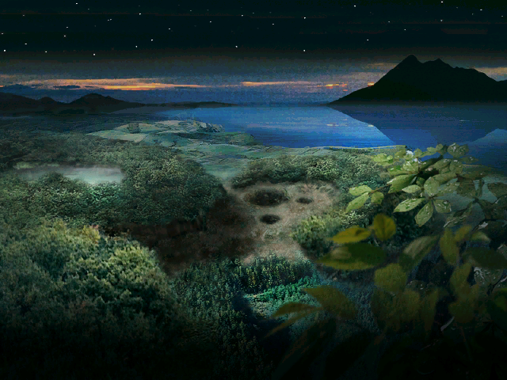

<h1 align="center"> Distant Forest 

 

## Table of Contents

* ***What is this?***
	- A faithful recreation of the Pikmin 1 debug programs source code.
		- Using the same tools and compiler available back in 2001 when the program was being developed.
		- Has the compiled ASM compared side-by-side for accuracy and veracity.

* **Overview** 
	- This project provides compileable, readable code that has been reverse engineered from the debug .exe and accompanying .dll(s).
	- It was created with improvement in mind, and as we get closer to completely RE'ing the executable files we will improve the program so that, if needed, you can even create your own programs based off of them.

* **File names**	
	- Inside each of the 4 folders contains everything we have reversed from the exectuable in seperate `.cpp` and `.h` files for easy access/reading.
		- Note: some folders currently contain nothing, because we simply haven't gotten around to creating the projects / decompiling the appropriate functions
	
	**DLL names**
	
	- `sysCore` is the main .dll that is `imported` by all of the other .dlls and `sysBootup.exe`.
		- This .dll is the most important, and contains a **LOT** of classes/functions, which explains the size of the folder and the size of the .dll. It is used all throughout the plugins and sysBootup.
		
	- `sysBootup` is the .exe of the project, it has the capability to load the seperate .dll files.
	
	- `plugTexConv` is used to convert .tga files to the texture format `.txe`, and can be used to edit/convert model files.
	
	- `plugAtxServer` is a server used to interface with the other plugins by creating windows and displaying `Nodes`.
	

# Setup

* **NOTE: you will need a Windows XP ISO, or a machine that has Windows XP installed**
	- The first and only tool that we'll need is a Visual Studio 6.0 ISO, or installer, to get that go [here and install it](https://winworldpc.com/product/microsoft-visual-stu/60)
	- Once that is done, find a suitable directory and download the project (using GIT or the internet) into that folder.
	- Then open up any of the 4 folders we currently have, and open the .dsp project file, and... violá! ***You're ready to start reversing!***

# Contributing

* **NOTE: you will need a reverse engineering tool, [IDA](https://www.hex-rays.com/products/decompiler/) Is an expensive feature-full decompiler. However if you haven't got a lot of money, go for [Ghidra](https://ghidra-sre.org/), which is free.**

	- First, some rules:
		- All new classes need to be in seperate `.cpp` and `.h` files 
			- this is for ease-of-use and to try and stop confusion about where a class is defined.
		- You must compare your compiled ASM against the target compiled ASM
			- this is for accuracy and assurance that the code you have produced is correct.
	
	- Now that we have that out of the way, heres how to contribute:
		 
		- After checking your code is correct, submit a **pull request** and me / Pixel will take a look and either accept it, reject it, or point out some places that could be improved!
		
# Credits

### Main Programmers
* **John Fiddleystein / Ambrosia**
* **Pixel**
